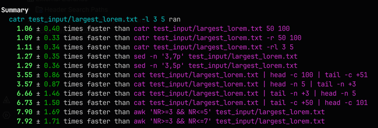

# `catr` - cat with range

`catr` is a command-line utility similar to the Unix `cat` command but with enhanced functionality. It allows users to
extract specific portions of text from a file by defining start and either end or length, offering extra flexibility and
precision in text extraction.

`catr` is licensed under GLWTS. For more information, please refer to the LICENSE file.

## `catr` Usage Overview

`catr` enhances the traditional Unix `cat` command, offering targeted text extraction capabilities. With `catr`, users
can effortlessly extract character or line ranges from a file.

### Quick Examples

- **Character Count from a Character**: Extract 10 characters starting from the 50th character from `file.txt`:

```sh
catr file.txt 50 10
```

- **Character Range**: Extract characters 50 to 100 from `file.txt`:

```sh
catr file.txt -r 50 100
```

- **Line Range**: Extract lines 10 to 20 from `file.txt`:

```sh
catr file.txt -rl 10 20
```

- **Line Count from a Line**: Extract 5 lines starting at line 3 from `file.txt`:

```sh
catr file.txt -l 3 5
```

## Installation Guide for `catr`

Follow these steps to install the `catr` command-line tool on your system. This guide assumes you have `gcc` installed
and are using a Unix-like operating system.

## Comparing `catr` with `cat`, `awk`, and `sed`

While both `catr` and `cat` can display text from files, `catr` provides additional capabilities for more specific text
extraction without the need for combining multiple commands.

All the following examples are ran with [hyperfine](https://github.com/sharkdp/hyperfine) to measure the time it takes
to run each command. The tests were run on a MacBook Pro M2 Pro chip, 16GB RAM, and macOS 14.3.1.

For more information on the tests, please refer to the [hyperfine results](docs/results.md).

Here is an overview of the results:



`catr` is more concise and easier to use for these tasks. And it also provides a more intuitive way to extract text
which could be useful for users who are not familiar with Unix commands and all the intricacies.

---

### Prerequisites

- Ensure you have `gcc` installed on your system to compile the source code. You can check this by
  running `gcc --version` in your terminal.
- This script is designed to work with `zsh`. If you are using a different shell, you might need to adjust the script or
  the instructions accordingly.

### Installation Steps

1. **Clone the repository or download the source code:**
   If you have `git` installed, you can clone the repository using the following command:

```bash
git clone https://github.com/Andree37/catr.git
```

Alternatively, download the source code to your local machine.

2. **Run the installation script:**

Execute the installation script with the following command:

```bash
./install.sh
```

This script will compile the `catr` program, create a directory at `$HOME/bin` (if it doesn't already exist), and place
the `catr` executable there. It will also ensure that the `$HOME/bin` directory is added to your PATH by updating
the `.zshrc` file.

If you encounter any permissions errors while running the script, you might need to grant execution permissions to the
script:

```bash
chmod +x install.sh
```

and then rerun the script.

3. **Restart your terminal or source your profile:**

For the changes to take effect, either restart your terminal or source your profile with the following command:

```bash
source ~/.zshrc
```

If you are using a different shell, source the corresponding configuration file for your shell.

4. **Verify the installation:**
   Once the installation is complete and your terminal is restarted (or your profile is sourced), you can verify the
   installation of `catr` by running:

```bash
catr --help
```

This command should display the usage information for `catr`.

Congratulations! You have successfully installed `catr` on your system.
